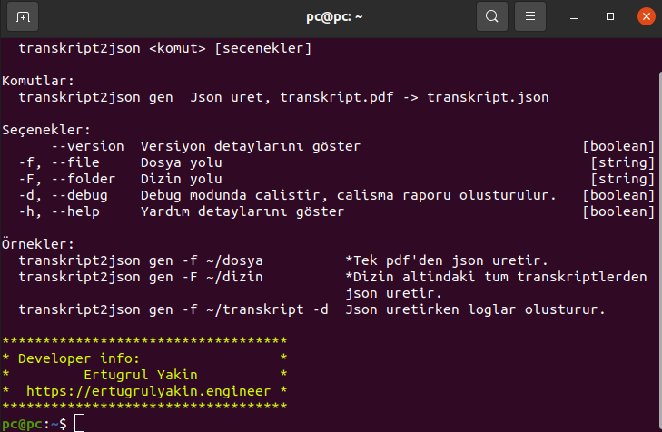
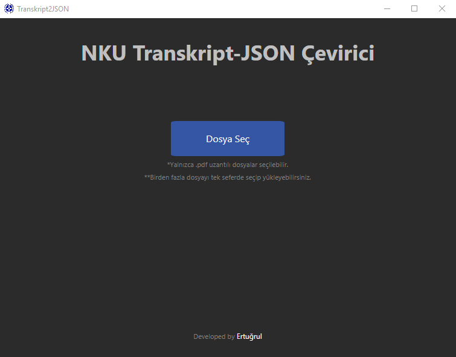
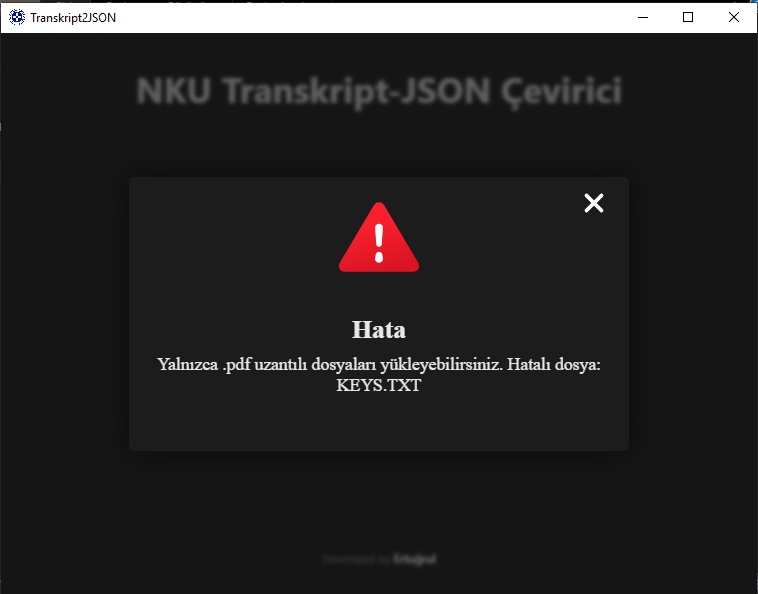
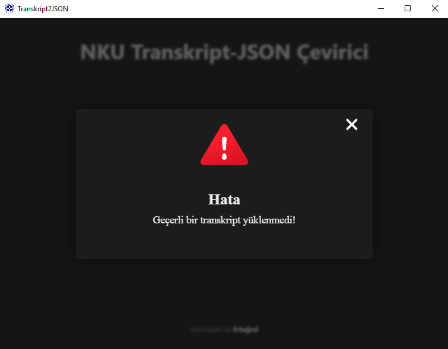
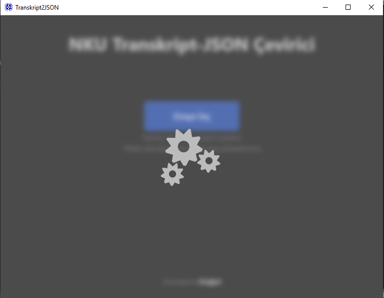
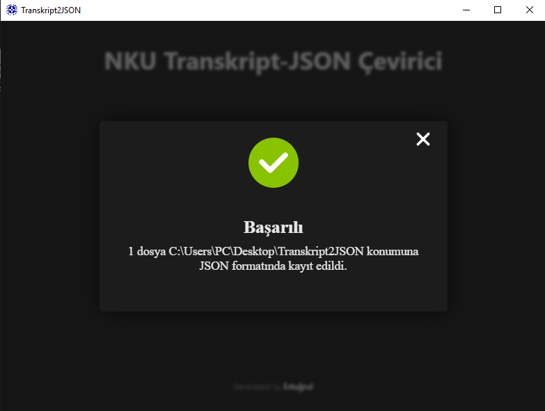

# NKU Transkript2JSON

	

 

**İçerik Tablosu**

[TOC]

---

### Nedir?

_Transkript2JSON_ programı, Namık Kemal Üniversitesi'ne ait .pdf uzantılı transkript dosyalarından json tipinde veri oluşturmak için yazılmış desktop uygulamasıdır. Electron.js ve Node.js kullanılarak geliştirilmiştir. Grafik arayüzünün yanı sıra cli üzerinden de çalışabilecek şekilde kodlanmıştır, gelecekte oluşabilecek potansiyel hatalar için debug modu içermektedir.

---

###Nasıl Çalışır?

<ul>
	<li>Program bir veya daha fazla sayıda dosya ile çalışabilir.</li>
	<li>Gönderilen dosyaların uzantısını kontrol eder, pdf olmayanları işlemez.</li>
	<li>Gönderilen pdf dosyalarının içeriğini kontrol eder, Namık Kemal Üniversitesi'ne ait olmayan dosylarda işleme devam etmez.</li>
	<li>Geçerli bir dosya ise: </li>
	<ul>
		<li>Pdf'den sayfaları çıkartıp metinleri alır, içeriği kontrol eder gerekli bilgilerin sayfalarını belirler.</li>
		<li>Sayfadaki metinleri küçük parçalar halinde obje olarak alır.</li>
		<li>Anahtar-değer şeklinde text aramak yerine öğrenci bilgileri, dönem bilgileri, ders bilgileri, genel sonuçlar gibi bölümler için başlangıç ve bitiş index'leri belirlendikten sonra algoritma tabanlı çalışır. </li>
		<li>Derslere ait özel durumları da göz önünde bulundurarak eksik index'leri kontrol eder ve doldurur.</li>
		<li> Gerekli veri çıkartıldıktan sonra doğruluğu kontrol edilip json yapısına dönüştürülür</li>
		<li>Adında çalıştırılma tarihini içeren yeni bir klaösür oluşturulur, üretilen dosyalar eskidosyaadı.json olarak kayıt edilir. </li>
	</ul>
</ul>

---

### CLI

CLI için grafik arayüzünden farklı olarak debug modu ve bazı ekstra kolaylıklar kodlanmıştır: 

 

	

 
<h5>Ek özellikler: </h5>
<ul>
	<li>
		<b>Debug modu:</b> -d flag'ı ile çalıştırılır, çıktı klasöründe programın çalışma süresince çalışan her metot/fonksiyon için çalışmaya başlama zamanı, işlevi, aldığı parametrelerin değerleri, ve geri döndürdüğü değerleri içeren bir debug.log dosyası oluşturur, terminalde sadece özet runtime bilgilerini görüntüler.
	</li>
	<li>
		<b>Dizin ile çalışma: </b>Birden fazla dosya için dosya yolu girmek zahmetli olacağından, -F flag'ı ile dizin yolu gönderilerek otomatik olarak dizin altındaki tüm transkriptlerde çalıştırılabilir, program sadece transkriptleri işleyecektir.
		<ul>
			<li>Gönderilen yolun dizin olup olmadığını kontrol eder.</li>
			<li>Alt dizin varsa atlar ve terminalde alt bir dizinin atlandığına dair bir uyarı gösterilir.</li>
			<li>Dizin içerisindeki tüm dosyalar sırasıyla okunup formatları kontrol edilir, pdf olmayan dosyalar atlanır.</li>
			<li>Pdf dosyalarının içeriği kontrol edilir, transkript olmayan dosyalar atlanır ve terminalde dosyanın atlandığına dair bir uyarı gösterilir.</li>
			<li>Geçerli transkript dosyaları işlenip dizin içerisinde T2J_OUTT2J_OUT(çalıştırılma_tarihi) adlı bir klasör oluşturulup json dosyaları kayıt edilir.</li>
		</ul>
	</li>
</ul>

---

### Grafik Arayüzü

	

 

	

 

	

 

	

 

	

---

### Kurulum

> Installer klasörü içerisindeki **Transkript2JSON.msi** dosyası ile Windows için, **Transkript2JSON_1.0.0_setup.deb** dosyası ile Debian tabanlı sistemler için kurulum yapılabilir.
